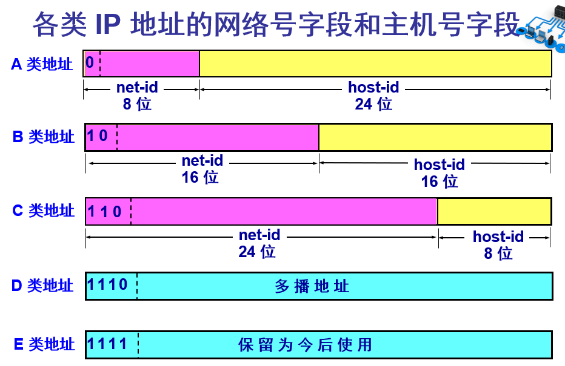

# 0计算机网络

### **一、计算机网络概述**

#### 1.1 互联网概述

​	计算机网络：是将一个分散的、具有独立功能的计算机系统，通过通信设备与线路连接起来，由功能完善的软件实现资源共享和信息传递的系统。

​	计算机网路是互连的、自治的计算机集合。

​	互联-互联互通	通信链路

​	自治-无主从关系

​	互联网：特指Internet。

​	计算机网络（简称为网络）：由若干结点（node）和连接这些结点的链路（link）组成。

​	互连网：可以通过路由器把网路互连起来，这就构成了覆盖范围更大的计算机网路，称之为互连网，又称为“网络的网络”。

​	主机：与网络相连的计算机。

internet和Internet的区别：

​	internet：泛指由多个计算机网络互连而成的网络。

​	Internet：指当前全球最大的、开放的、由众多网络相互连接而成的特定计算机网络，采用TCP/IP协议族作为通信的规则，前身是美国的ARPANET

#### 1.2 计算机网路的功能

​	1、数据通信（连通性）

​	2、资源共享		硬件	软件	数据

​	3、分布式处理		多台计算机各自承担同一工作任务的不同部分，如Hadoop平台

​	4、提高可靠性		网络链路上的某一台主机宕机，其它链路不受影响

​	5、负载均衡		各计算机之间均衡负载流量

#### 1.3 互联网的组成

​	1、组成部分	硬件、软件、协议

​	2、工作方式	

​		边缘部分	由所有连接在互联网上的主机组成，由用户直接组成，用来进行通信（传送数据、音频和视频）和资源共享，又称资源子网

​			C/S方式

​			P2P方式

​		核心部分	由大量网络和连接这些网络的路由器组成。这部分是为边缘部分提供服务的（提供连通性和交换），又称通信子网

​			网络、路由器等

​	3、功能组成

​		数据通信		通信子网	实现数据通信

​		资源共享		资源子网	实现资源共享/数据处理

##### 	1.3.1 互联网的边缘部分

​		处在互联网边缘的部分是连接在互联网上的所有的主机。这些主机又称为端系统。

​		端系统在功能上可能有很大区别，可能是个人电脑、手机或大型计算机，拥有者可以是个人、学校、企业、国家等。

​	5、端系统之间通信的含义

​		主机A和主机B进行通信，实际上是指：运行在主机A是上的某个程序和运行在主机B上的另一个程序进行通信。即：主机A的某个进程和主机B的某个进程进行通信，简称为计算机之间通信。

​	6、端系统之间的两种通信方式

​		客户-服务器方式（C/S方式、Client/Server方式）

​			客户和服务器都是指通信中所涉及的两个应用进程。

​			客户-服务器方式所描述的是进程之间服务和被服务的关系，客户是服务的请求方，服务器是服务的提供方。

​			服务请求方和服务提供方都要使用网络核心部分所提供的服务。

​			客户软件的特点：

​				被用户调用后运行。在打算通信时主动向远地服务器发起通信（请求服务）。因此，客户服务器必须知道服务器程序的地址。

​			服务器软件的特点：

​				一种专门用来提供某种服务的程序，可同时处理多个远地或本地客户的请求。

​				系统启动后即自动调用并一直不断地运行着，被动地等待着来自各地的客户的通信请求。因此，服务器程序不需要知道客户程序的地址。

​			客户与服务器的通信关系建立后，通信可以是双向的，客户与服务器都可发送和接收数据。

​		对等方式（P2P方式、Peer-to-Peer方式）

​			对等连接是指两个主机在通信时并不区分哪一个是服务请求方还是服务提供方。

​			只要两个主机都运行了对等连接软件（P2P软件），它们就可以进行平等的、对等连接通信。

​			双方都可以下载对方已经存储在硬盘中的共享文档。

​			对等连接工作方式可以支持大量对等用户同时工作。

##### 		1.3.2 互联网的核心部分

​		互联网中的核心部分要向网络边缘中的大量主机提供连通性，使边缘部分中的任何一个主机都能够向其它主机通信（即传送或接收各种形式的数据）

​		在网络核心部分起特殊作用的是路由器。

​		路由器是实现分组交换的关键构件，其任务是转发收到的分组，这是网络核心部分最重要的功能。

​		路由器之间一般都用高速链路相连接，而在网络边缘的主机接入到核心部分则通常以相对较低速率的链路相连接。

​		主机的用途是为用户进行信息处理的，并且可以和其它主机通过网络交换信息。路由器的用途则是用来转发分组的，即进行分组交换的。

​		路由器：

​			在路由器中的输入和输出端口之间没有直接连线。

​			路由器处理分组的过程是：

​				把收到的分组先放入缓存（暂时存储）；

​				查找转发表，找出某个目的地址应从哪个端口转发；

​				把分组送到适当的端口转发出去。

​		主机和路由器的不同：

​			主机是为用户进行信息处理的，并向网络发送分组，从网络接收分组。

​			路由器对分组进行请求转发，最后把分组交付目的主机。

#### 1.4 电路交换

​	N部电话机两两直接相连，需要N * (N - 1) / 2对电线。

​	随着电话机的数量增多，就要使用交换机来完成全网的交换任务。每一部电话机都直接连接到交换机上，而交换机使用交换的方法，让电话用户彼此之间可以更方便地通信。

​	“交换”的含义就是转接，把一条电话线转接到另一条电话线，使它们连通起来。

​	从通信资源的分配角度来看，“交换”就是按照某种方式动态地分配传输线路的资源。

##### 	1.4.1 电路交换特点

​		电路交换必定是面向连接的。

​		电路交换分为三个阶段：

​			建立连接：建立一条专用的物理连接，以保证双方通话时所需的通信资源子网通信时不会被其它用户占用；

​			通信：主叫与被叫双方就能互相通电话；

​			释放连接：释放刚才使用的这条专用的物理通路（释放刚才占用的所有通信资源）

##### 	1.4.2 电路交换缺点

​			1、计算机数据具有突发性。

​			2、通信线路的利用率很低。

#### 1.5 分组交换

​	分组交换采用存储转发技术。

​	分组交换网以“分组“作为传输单元。

##### 	1.5.1 分组交换的过程

​	1、在发送端，先把较长的报文划分为较短的、固定长度的数据段。

​	2、在每一个数据段前面添加上首部构成分组。

​	3、依次把各分组发送到接收端。

​	4、接收端收到分组后剥去首部还原成报文。

​	5、最后，在接收端把收到的数据恢复成原来的报文。

##### 	1.5.2 分组首部的重要性

​		每一个分组的首部都含有地址等控制信息（诸如目标地址和源地址）

​		分组交换网中的节点交换机根据收到的分组首部中的地址信息，将分组转发到下一个节点交换机。

​		每个分组在互联网中独立地选择传输路径。

​		使用这种请求转发方式，最后分组就能到最终目的地。

##### 	1.5.3 分组交换的优点

​		1、高效 在分组传输的过程中动态分配传输带宽，对通信链路是逐段占用。

​		2、灵活 为每一个分组独立地选择最合适的转发路由。

​		3、迅速 以分组作为传送单位，可以不先建立连接就能向其它主机发送分组。

​		4、可靠 保证可靠性的网络协议；分布式多路由的分组交换网，使网络有很好的生存性。

##### 	1.5.4 分组交换的缺点

​		1、分组在各结点存储转发时需要排队，会造成一定的时延。

​		2、分组必须携带的首部也造成一定的开销。

#### 1.6 报文交换

​	基于存储转发原理。

​	从A直接传送到B，之后从B直接传送到C，和分组转发过程相似，但是直接转发全部数据。

#### 1.7 三种交换方式的比较

​	1、若要连续传送大量数据，且其传送时间远大于连接建立时间，则电路交换的传输速率较快。

​	2、报文交换和分组交换不需要预先分配传送带宽，在传送突发数据时可提高整个网络的信道利用率。

​	3、由于一个分组的长度往往远小于整个报文的长度，因此分组交换比报文交换的时延小，同时也具有更好的灵活性。

#### 1.8 网络的分类

##### 1.8.1 按网络的作用范围进行分类

​		广域网：WAN，作用范围几十到几千公里

​		城域网：MAN，作用距离约为5~50公里

​		局域网：LAN，局限在较小的范围（如1公里左右）

​		个人区域网：PAN，范围更小，大约在10米左右

​		PS：若中央处理机之间的距离非常近（如仅1米的数量级甚至更小些，则一般称为多处理机系统，而不称为计算机网络）

##### 1.8.2 从网络的使用者进行分类

​		公用网：按规定缴纳费用的人都可以使用的网络，因此可以称为公用网。

​		专用网：为特殊业务工作的需要而建造的网络。

##### 	1.8.3 用来把用户接入到互联网的网络

​		接入网 AN，又称为本地接入网或居民接入网。

​		接入网是一类比较特殊的计算机网络，用来将用户接入互联网/

​		接入网本身既不属于互联网的核心部分，也不属于互联网的边缘部分。

​		接入网是从某个端系统到另一个端系统的路径中，由这个端系统到第一个路由器（也称为边缘路由器）之间的一些物理链路组成的。

​		从覆盖的范围看，很多接入网还是属于局域网。

​		从作用上看。接入网只是起到让用户能够与互联网连接的“桥梁”作用。

#### 1.9 计算机网络的性能

​	速率：数据的传送速率，也称为数据率或比特率，单位为bit/s，或kbit/s、Mbit/s等。指额定速率或标称速率，不是实际速率。

​	带宽：表示网络中某通道传送数据的能力，表示在单位时间内网络中的某信道所能通过的“最高数据率”，单位是bit/s。

​	吞吐量：表示在单位时间内通过某个网络（或信道、接口）的数据量。吞吐量受网络带宽或网络额定速率的限制。

​	时延：指数据（一个报文或分组，甚至比特）从网络（或链路）的一端传送到另一端所需的时间，也称为延迟或迟延。包括：发送时延、传播时延、处理时延、排队时延。

​	时延带宽积：链路的时延带宽积又称为以比特为单位的链路长度。

​	往返时间RTT：从发送方发送数据开始，到发送方收到来自接收方的确认，总共经历的时间。

​	利用率：分为信道利用率和通信利用率。

​		信道利用率指出某信道有百分之几的时间是被利用的（有数据通通过），完全空闲的信道利用率是0。

​		网络利用率是全网络的信道利用率的加权平均值。

#### 1.10 计算机网络体系结构

​	计算机网络的体系结构是计算机网络的各层及其协议的集合。

​	网络协议是为进行网络中的数据交换而建立的规则、标准或约定。

​	网络协议的三个组成要素：

​		语法：数据与控制信息的结构或格式。

​		语义：需要发出何种控制信息，完成何种合作以及做出何种响应。

​		同步：事件实现顺序的详细说明。

​	体系结构是计算机网络及其部件所应完成功能的精确定义。

##### 1.10.1 OSI七层协议体系结构

​	应用层、表示层、会话层、运输层、网络层、数据链路层、物理层

##### 1.10.2 TCP/IP四层体系结构

​	应用层、运输层、网际层、网络连接层

##### 1.10.3 五层协议体系结构

​	应用层、运输层、网络层、数据链路层、物理层

传输过程：

​	1、应用数据先传送到应用层，加上应用层首部，成为应用层PDU（协议数据单元）；

​	2、应用层PDU再传送到运输层，加上运输层首部，成为运输层报文；

​	3、运输层报文再传送到网络层，加上网络层首部，成为IP数据报（或分组）；

​	4、IP数据报再传送到数据链路层，加上链路层首部和尾部，成为数据链路层帧；

​	5、数据链路层帧再传送到物理层，最下面的物理层把比特流传送到物理媒体；

​	6、电信号（或光信号）在物理层中传播从发送端物理层传送到接受端物理层；

​	7、物理层接收到比特流，上交到物理链路层；

​	8、物理链路层剥去帧首部和帧尾部取出数据部分，上交给网络层；

​	.......

​	实体表示任何可发送或接收信息的硬件或软件进程。

​	协议是控制两个对等实体进行通信的规则的集合。

​	在协议的控制下，两个对等实体间的通信使得本层能够向上一层提供服务。

​	要实现本层协议，还需要使用下层所提供的服务。

### **二、物理层**

#### 2.1 物理层的基本概念

​	物理层的作用是尽可能地屏蔽掉不同传输媒体和通信手段的差异，使上面的数据链路层感觉不到这些差异。

​	用于物理层的协议也被称为物理层规程。

​	物理层的主要任务：确定与传输媒体的接口的一些特性。

​		机械特性：指明接口所用接线器的形状和尺寸、引线数目和排列、固定和锁定装置等。

​		电气特性：指明在接口电缆的各条线上出现的电压的范围。

​		功能特性：指明在某条线上出现的某一电平的电压的意义。

​		过程特性：指明对于不同功能的各种可能事件的出现顺序。

#### 2.2 数据通信的基础知识

##### 2.2.1 概念

​	数据：运送消息的实体。

​	信号：数据的电气或电磁表现。

​	模拟信号：代表消息的参数取值连续。

​	数字信号：代表消息的参数取值离散。

​	码元：在使用时域的波形表示数字信号时，代表**不同离散数值的基本波形**。	

​	信道：一般用于表示向某一个方向传送信息的媒体。

​	单向通信（单工通信）：只能有一个方向的通信而没有反方向的交互。

​	双向交替通信（半双工通信）：通信的双方都可以发送信息，但不能双方同时发送，也不能同时接收。

​	双向同时通信（全双工通信）：通信的双方可以同时发送和接收信息（实质是发送和接收分开）。

##### 2.2.2 信号调制

​	基带信号：即基本频带信号，如计算机输出的各种文字、图像等。基带信号包含很多低频部分以及直流部分，而很多信号并不能传输低频分量和直流分量，因此需要对基带信号进行调制。

​	调制分为：

​		基带调制：仅对基带信号的波形进行变换，使它能够与信道特性相适应。**变换后的信号仍然是基带信号**，又称为编码。

​			常用编码方式：

​				不归零制：正电平代表1，负电平代表0

​				归零制：正脉冲代表1，负脉冲代表0

​				曼彻斯特编码：位周期中心的向上跳变代表0，位周期中心的向下跳变代表1

​				差分曼彻斯特编码：位开始边界有跳变代表0，位开始边界没有跳变代表1

​		带通调制：使用载波进行调制，把基带信号转换为较高的频段，并转换为模拟信号。

​			带通调制方法：调幅、调频、调相

​	带通信号：经过载波调制后的信号。

##### 2.2.3 信道的极限容量

​	码元传输的速率越高，或信号传输的距离越远，或传输媒体质量越差，在信道的输出端的波形失真就越严重。

​	因素：信道能够通过频率范围、信噪比

​	信噪比：信号的平均功率和噪声的平均功率之比，记为S/N，单位dB

​		信噪比 = 10 log(10) (S/N)

​	香农公式：

​		信息的极限信息传输速率 C = W log(2) (1 + S/N)  (bit/s)

​		其中： W为信道的宽度，单位Hz

​					 S为信道内所传信号的平均功率

​					 N为信道内部的高斯噪声功率。

​	信道的带宽或信道中的信噪比越大，则信息的极限传输速率越高，实际信道传输速率比香农的极限传输速率低很多。

#### 2.4 信道复用技术

​	复用是指允许用户使用一个共享信道进行通信，降低成本，提高利用率。

​	频分复用技术：将整个带宽分成多份，用户分配到指定的频带之后，在通信过程中自始至终都在占用此频带。频分复用的所有用户在同样的时间占用不同的带宽资源（即频率带宽）。

​	时分复用技术：将时间划分为一段段等长的时分复用帧（TDM帧）。每一个时分复用的用户在每一个TDM帧中占用固定序号的时间片。每一个用户所占用的时间片是周期性出现的（即TDM帧的长度）。因此TDM信号也被称为等时信号。时分复用的所有用户是在不同的时间占用同样的频带宽度。**该技术可能会造成线路资源的浪费。**

​	统计时分复用技术：类似时分复用技术，但实为按需动态分配时间片，因此可以提高线路的利用率。

​	波分复用技术：光的频分复用，利用光的波长划分。

​	码分复用技术：

​		采用码分多址技术。
​		码片序列：即将每个bit时间划分为m个短的时间间隔，称为码片。如果发送的为比特1，则发送mbit码片序列。如果发送比特0，则发送mbit的反码。

​		S * T = 0   S * S = 1  S * S反 = 0

### 三、数据链路层

数据链路层使用的信道类型：

​	点对点信道：一对一的点对点通信方式

​	广播信道：一对多的广播通信方式

#### 3.1 点对点通信

##### 3.1.1 数据链路和帧

​	**链路**是一条点对点的物理线路段，中间没有交点。一条链路只是一个通路的组成部分。

​	数据链路：把实现控制数据传输的通信协议的软件和硬件加在链路上，构成数据链路。常用适配器（网卡）来实现这些协议的硬件和软件。一般适配器包含数据链路层和物理层两层的功能。

##### 3.1.2 三个基本问题

​	1、封装成帧

​		在一段数据的前后分别添加首部和尾部，构成一个帧，确定帧的界限。首部和尾部的重要作用是进行帧定界。数据链路层的最大帧长MTU。

​		帧首部：SOH

​		帧尾部：EOT

​	2、透明传输

​		表示的是：无论什么样的比特组合的数据，都能够按照原样没有差错的通过数据链路层，或者是，数据链路层对于这些数据是透明的。

​		如果帧中的某一节二进制代码和SOH或者EOT一样，则数据链路层可能会错误舍弃帧数据。

​		解决方法：字节填充（同步传输）和字符填充（异步传输）

发送端的数据链路层在SOH和EOT前面加上ESC，接收端的数据链路层将数据送到网络层之前删除ESC，如果ESC也在数据中，也要加ESC。

​	3、差错控制

​		循环冗余校验码CRC。

​		并不是可靠传输，只能实现无比特差错，不能实现无传输差错。可靠传输需要避免帧丢失、帧重复、帧失序等问题，数据链路层的协议均不是可靠传输的协议。

#### 3.2 PPP协议

PPP协议的组成部分：

​	1、一个将IP数据报封装到串行链路的方法

​	2、链路控制协议LCP：建立、配置和测试链路连接。

​	3、网络控制协议NCP：建立网络层连接。

同步采用比特填充，异步采用字符填充。

​	字符填充：0x7E 转化为 (0x7D, 0x5E)，0x7D 转化为 (0x7D, 0x5D)

​	零比特填充：发送端只要有5个连续1，则其后新增1个0；接收端只要收到5个连续1，则其后删除1个0。

#### 3.3 使用广播通信的数据链路层

##### 3.3.1 局域网的数据链路层

特点：

- 网络为一个单位所拥有；
- 地理范围和站点数目有限。

局域网的优点：

- 具有广播功能，从一个站点可以很方便的访问全网。局域网上的主机可共享连接在局域网上的各种硬件和软件资源。
- 便于系统的扩展和逐渐地演变，各设备的位置可灵活调整和改变。
- 提高了系统的可靠性、可用性和残存性。

数据链路层的两个子层：

- 逻辑链路控制LLC子层
- 媒体接入控制MAC子层

适配器的作用：

- 进行串行/并行转换
- 对数据进行缓存
- 在计算机的操作系统安装设备驱动程序
- 实现以太网协议

##### 3.3.2 CSMA/CD协议

CSMA/CD协议：载波监听多点接入/碰撞检测。

**”多点接入“**：表示许多计算机以多点接入的方式连接到一根总线上。

**“载波监听”**：每个站点发送给数据之前先检测一下总线上是否有其它计算机在发送数据，如果有，则暂时不发送数据。

**“碰撞检测”**：计算机边发送数据边检测信道上的信号电压。

​	使用CSMA/CD协议的以太网不能进行全双工通信，只能进行半双工通信。

​	争用期：端到端往返时延。

​	争用期的长度：10Mbit/s以太网取51.2us，争用期内可发送512bit，即64字节。因此最短有效帧长为64字节。

##### 3.3.3 以太网的MAC层

1、MAC层的硬件地址

​	在局域网中，硬件地址又称为物理地址或MAC地址。

​	长度为6字节（48位）或2字节（16位）这两种中的一种。

前3个字节（即高位24位）由IEEE的注册管理机构RA向厂家分配，称为组织唯一标识符；

后3个字节（即低位24位）由厂家自行选派，称为扩展唯一标识符。

发往本站的帧，分为三种：

- 单播帧（一对一）：本站的MAC地址
- 广播帧（一对全体）：全为1，即FF-FF-FF-FF
- 多播帧（一对多）

所有适配器至少需要识别单播地址和广播地址。

数据链路层一次传输数据的范围在64B - 1518B之间。

​	此时目的地址为目的主机MAC地址，源地址为发送发MAC地址。FCS为CRC的检验码，类型为上层协议的类型，共占用18B，因此IP数据报最多1500B。

​	MAC帧前的8字节为同步码，使用曼彻斯特编码方式检验，当出现11时即表示同步完成，开始传输。

### 四、网络层

#### 4.1 网络提供的两种服务

​	面向连接（虚电路服务）：

​		由网络负责。通信之前需要先建立虚电路，如果再使用可靠传输的网络协议，就可使所发送的分组无差错按序到达终点，不重复、不丢失。资源占用比较高。

​	无连接（数据报服务）：

​		由端系统负责。网络层向上提供简单灵活的、无连接的、尽最大努力交付的数据报服务。网络在发送分组时不需要建立连接，每个分组独立发送，与其前后的分组无关。发送的数据可能存在重复、丢失、失序，同时也不能保证传送的时间。分组的携带完整端地址。

#### 4.2 网际协议IP

​	网际协议IP是TCP/IP体系中两个最重要的协议之一。

​	与IP协议配套使用的还有三个协议：

- 地址解析协议ARP：介于网络接口层和网络层之间
- 网际控制报文协议ICMP：介于网络层和运输层之间
- 网际组管理协议IGMP：介于网络层和运输层之间

##### 4.2.1 虚拟互联网络

​	将网络互相连接起来要使用中间设备，又称为中间系统或中继系统。

- 物理层中继系统：转发器

- 数据链路层中继系统：网桥或桥接器

- 网络层中继系统：路由器

- 网桥和路由器的混合物：桥路器

- 网络层以上的中继系统：网关

  网络互连是指用路由器进行网路互连和路由选择。

虚拟互联网络的概念：

​	实质是逻辑互联网络，即互连起来的各种物理网络的异构性本来是客观存在的，但利用IP协议可使得这些性能各异的网络从用户看起来是一个统一的网络。

​	使用IP协议的虚拟互连网络可简称为IP网。

##### 4.2.2 IP地址分类

​	IP地址就是给每个连接在互联网上的主机（或路由器）分配一个在全世界范围内是唯一的32位的标识符。

​	每类地址都是由两个固定长度的字段组成，其中一个字段是**网络号**，它标志主机（或路由器）所连接到的网络，而另一个字段是**主机号**，它标志该主机（或路由器）。

| 网络类别 | 最大可指派网络数 | 第一个可指派的网络号 | 最后一个可指派的网络号 | 每个网络中最大主机数 |
| :------: | :--------------: | :------------------: | :--------------------: | :------------------: |
|    A     |   126 2^7 - 2    |          1           |          126           |       16777214       |
|    B     |   16384 14 - 1   |        128.1         |        191.255         |        65534         |
|    C     |  2097151 21 - 1  |       192.0.1        |      223.255.255       |         254          |

特殊的IP地址（保留IP地址）：

| **网络号** |     **主机号**     | **源地址**  **使用** | **目的地址**  **使用** | **代表的意思**                                               |
| :--------: | :----------------: | -------------------- | ---------------------- | ------------------------------------------------------------ |
|     0      |         0          | 可以                 | 不可                   | 在本网络上的本主机                                           |
|     0      |      host-id       | 可以                 | 不可                   | 在本网络上的某台主机host-id                                  |
|    全1     |        全1         | 不可                 | 可以                   | 只在本网络上进行广播（理论上可以播放到全世界，但各路由器均不转发，又称为受限广播） |
|   net-id   |        全1         | 不可                 | 可以                   | 对net-id上的所有主机进行广播                                 |
|    127     | 非全0或全1的任何数 | 可以                 | 可以                   | 用作本地软件环回测试之用                                     |

​	IP地址的重要特点：

- IP地址是分等级的地址结构（分为网络号和主机号）。

- IP地址是标志一个主机（或路由器）和一条链路的接口。

  当一个主机同时连接到两个不同的网络时，该主机必须具有两个相应的IP地址，其网络号必须不同，这种主机称为**多归属主机**。

  一个路由器至少需要连接到两个网络上（这样它才能将IP数据报从一个网络转发到另一个网络），因此一个路由器至少应当有两个不同的IP地址。

- 用转发器或网桥连接起来的若干个局域网仍为一个网络，具有同样的网络号。

- 所有分配到网络号的网络，无论是范围很小的局域网，还是覆盖范围很大的广域网，都是平等的。

##### 4.2.3 IP地址和硬件地址

从层次上看：

​	硬件地址是数据链路层和物理层使用的地址，IP地址是网络层及以上各层使用的地址，是一种逻辑地址（IP地址使用软件实现）。

​	IP地址放在IP数据报的首部，而硬件地址放在MAC帧的首部。

#### 4.3 地址解析协议ARP

ARP作用：将从网络层使用的IP地址解析成数据链路层使用到的MAC地址。

每个主机中都有一个ARP高速缓存，存放的是所在局域网各主机的IP地址到MAC地址的映射表。如下：

<IP Address; MAC Address; TTL>   				TTL：地址映射有效时间

ARP高速缓冲的作用：

​	存放最近获得的IP地址到MAC地址的映射，以减少ARP广播的数量。

注意：

​	ARP是解决同一个局域网内的主机或路由器的IP地址和MAC地址的映射问题。如果目标主机和源主机不在同一个局域网，则先通过ARP找到一个位于当前局域网内的路由器的MAC地址，然后把分组转发给该路由器，让此路由器继续把分组转发到下一个局域网。